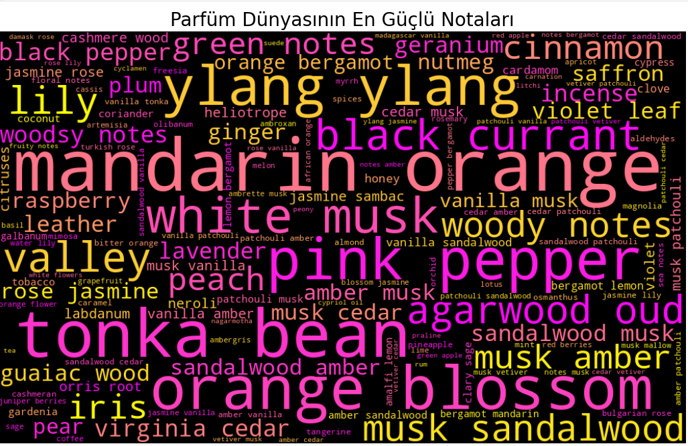

# Week_4_Perfume_Recommender_AI
Project Name: AI-Driven Fragrance Discovery Engine 🧪🍊

What it does: Uses Machine Learning (KNN) to analyze 24,000+ perfumes and find "Scent Soulmates" based on 1,600+ deep aromatic notes.

Tech Stack: Python, Scikit-learn, NLP (Text Mining), Pandas.

Key Insight: Proved the correlation between gender and scent families with a p-value of 0.0.

Initial Commit: Data cleaning and KNN recommendation engine
